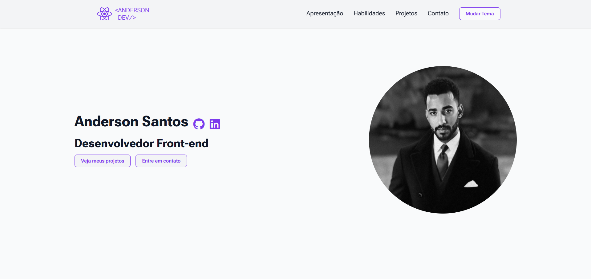

# Portfólio Pessoal - Anderson Santos



Bem-vindo ao repositório do meu portfólio pessoal! Este é um site de página única (single-page application) desenvolvido para apresentar minhas habilidades, projetos e informações de contato como Desenvolvedor Front-end.

**[➡️ Acesse a versão ao vivo](https://anderson-santos.netlify.app/)**

---

## ✨ Funcionalidades Principais

- **Design Responsivo:** Totalmente adaptável para desktops, tablets e dispositivos móveis.
- **Tema Claro/Escuro:** Sistema de troca de tema (light/dark mode) que persiste durante a navegação, com imagens dos projetos que se adaptam ao tema selecionado.
- **Navegação Suave:** Links de navegação com scroll suave para as diferentes seções da página.
- **Projetos Dinâmicos:** Seção de projetos com cards que exibem imagens (desktop e mobile), tecnologias utilizadas, descrição e links para o repositório e a versão ao vivo.
- **Interatividade:** Efeitos de `hover` e transições suaves que melhoram a experiência do usuário.
- **Formulário de Contato Funcional:** Integrado com o FormSubmit para recebimento de mensagens diretamente no e-mail.
- **Acessibilidade:** Uso de tags semânticas e atributos ARIA para garantir uma melhor acessibilidade.

---

## 🛠️ Tecnologias Utilizadas

O projeto foi construído utilizando tecnologias web modernas, com foco em código limpo e manutenível.

- **HTML5:** Estrutura semântica e bem organizada.
- **CSS3:** Estilização moderna com Flexbox, variáveis CSS para fácil customização de temas e design responsivo com Media Queries.
- **JavaScript (Vanilla):** Utilizado para adicionar interatividade, como o menu de navegação mobile e a funcionalidade de troca de tema.

### **Ferramentas e Bibliotecas**
- **Font Awesome:** Para os ícones utilizados em todo o site.
- **FormSubmit:** Para o processamento do formulário de contato sem a necessidade de um back-end.
- **Git & GitHub:** Para versionamento e hospedagem do código.

---

## 📂 Estrutura do Projeto

O código-fonte está organizado da seguinte forma para facilitar a manutenção:

```
Portiflio/
├── imagens/              # Imagens e assets visuais do projeto
├── scripts/
│   ├── mobile-navbar.js  # Lógica para o menu de navegação mobile
│   └── theme.js          # Lógica para a troca de tema (claro/escuro)
├── styles/
│   ├── apresentacao.css  # Estilos da seção de apresentação
│   ├── contato.css       # Estilos da seção de contato
│   ├── footer.css        # Estilos do rodapé
│   ├── header.css        # Estilos do cabeçalho
│   ├── habilidades.css   # Estilos da seção de habilidades
│   ├── index.css         # Estilos globais e variáveis CSS
│   └── projetos.css      # Estilos da seção de projetos
├── index.html            # Arquivo principal da aplicação
└── README.md             # Este arquivo
```

---

## 🚀 Como Executar Localmente

Para visualizar o projeto em sua máquina local, siga os passos abaixo:

1.  **Clone o repositório:**
    ```bash
    git clone https://github.com/AndersonSantosDias/Portiflio.git
    ```

2.  **Navegue até o diretório do projeto:**
    ```bash
    cd Portiflio
    ```

3.  **Abra o arquivo `index.html` no seu navegador de preferência.**

---

## 📫 Contato

Gostou do meu trabalho ou tem alguma sugestão? Entre em contato!

- **LinkedIn:** in/anderson-santos-817928199
- **Email:** Andersonsd.dev@gmail.com